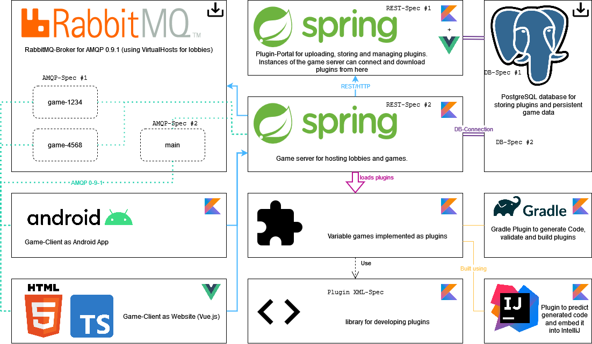

# Interface specifications

The following diagram shows the architectural components of this framework.

## Specifications of interfaces/data structures

The following paragraphs describe/show various specifications and reference the files containing technical specification (if available). The names of the specifications are marked in the above diagram.

### AMQP-Spec #1 (Global server broker)
### AMQP-Spec #2 (game lobby broker)
### REST-Spec #1 (plugin server)
### REST-Spec #2 (game/lobby server)
### DB-Spec #1 (plugin database)
### DB-Spec #2 (game database)
### XML-Spec #1 (plugin.xml)